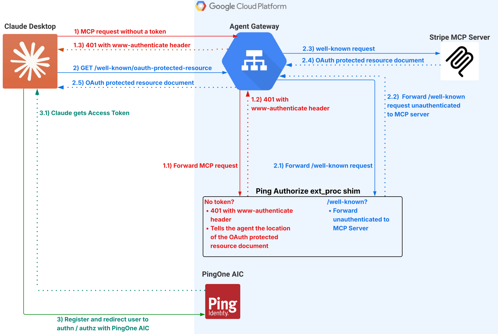

# GCP Agent Gateway + PingAuthorize

A proof of concept demonstrating centralized authorization for [MCP](https://modelcontextprotocol.io/) servers on GCP, using [PingAuthorize](https://docs.pingidentity.com/pingauthorize) as the policy decision point enforced at the network edge via [GCP's Service Callout Extensions](https://docs.cloud.google.com/service-extensions/docs/callouts-overview) and the Envoy [ext_proc](https://www.envoyproxy.io/docs/envoy/latest/configuration/http/http_filters/ext_proc_filter) protocol.

The sample MCP server wraps the [Stripe API](https://docs.stripe.com/api) and runs behind a GCP Agent Gateway. Every inbound request is intercepted by an ext_proc service that calls PingAuthorize to decide whether the request should be allowed or denied before it ever reaches the MCP server.

> [!WARNING]
> This is a proof of concept intended to demonstrate the integration pattern. **You must implement all preventive and defense-in-depth security measures before deploying to production.** Please review the [MCP Security Best Practices](https://modelcontextprotocol.io/specification/2025-11-25/basic/security_best_practices), the [Envoy External Processing filter documentation](https://www.envoyproxy.io/docs/envoy/latest/configuration/http/http_filters/ext_proc_filter), and the [GCP Service Extensions overview](https://cloud.google.com/service-extensions/docs/overview) before using this in any production environment.

## How It Works

### Obtaining an Access Token



1. The agent sends a request to the Agent Gateway without an access token
2. The Agent Gateway invokes `ping-authz-shim` via a Traffic Extension callout
3. The shim rejects the request with `401 Unauthorized` and a `WWW-Authenticate` header containing the protected resource metadata URL and required scopes
4. The agent discovers the authorization server by fetching `/.well-known/oauth-protected-resource` ([RFC 9728](https://datatracker.ietf.org/doc/html/rfc9728)), which the shim passes through to the MCP server
5. The agent dynamically registers a client ([RFC 7591](https://datatracker.ietf.org/doc/html/rfc7591)) and completes an OAuth 2.0 authorization code flow with PKCE ([RFC 7636](https://datatracker.ietf.org/doc/html/rfc7636)) against [PingOne AIC](https://www.pingidentity.com/en/platform/pingone-advanced-identity-cloud.html) to obtain an access token

### Authorizing a Request


1. The agent sends a request to the Agent Gateway with an access token
2. The Agent Gateway invokes `ping-authz-shim` via a Traffic Extension callout
3. The shim extracts the bearer token and request context, then sends a decision request to PingAuthorize
4. PingAuthorize evaluates the policy and returns allow or deny — rejected requests never reach the MCP server
5. Permitted requests are forwarded to `stripe-mcp`, which executes the requested tool on the user's behalf
6. The MCP server response is returned to the agent

## Services

| Service | Description |
|---|---|
| [`ping-authz-shim`](./ping-authz-shim/) | Envoy ext_proc shim — evaluates every inbound request against PingAuthorize |
| [`stripe-mcp`](./stripe-mcp/) | MCP server exposing Stripe tools |

## Protocols & Standards

- [Model Context Protocol (MCP)](https://modelcontextprotocol.io/) — tool interface between agent and server
- [Envoy ext_proc](https://www.envoyproxy.io/docs/envoy/latest/configuration/http/http_filters/ext_proc_filter) — external processing filter for request-level auth decisions
- [OAuth 2.0 Protected Resource Metadata (RFC 9728)](https://datatracker.ietf.org/doc/html/rfc9728) — resource server discovery
- [OAuth 2.0 Authorization Server Metadata (RFC 8414)](https://datatracker.ietf.org/doc/html/rfc8414) — authorization server discovery
- [OAuth 2.0 Dynamic Client Registration (RFC 7591)](https://datatracker.ietf.org/doc/html/rfc7591) — agent self-registration
- [PKCE (RFC 7636)](https://datatracker.ietf.org/doc/html/rfc7636) — proof key for code exchange

## Repository Structure

```
├── ping-authz-shim/       # ext_proc authorization shim (Go, gRPC)
├── stripe-mcp/            # MCP server with Stripe tools (Go, HTTP)
├── ping-authorize/        # PingAuthorize policy configuration
└── deploy/gcp/            # Cloud Build configs
```

## Prerequisites

- **GCP project** with Cloud Run, Cloud Load Balancing, and Service Extensions APIs enabled
- **Stripe account** with a [secret API key](https://docs.stripe.com/keys) and at least one customer with a payment method on file — the customer's email must match the user's email in PingOne AIC
- **PingOne AIC tenant** configured as the OAuth 2.0 authorization server with Dynamic Client Registration enabled
- **PingAuthorize** deployed on a GCE VM in the same GCP project (see [`ping-authorize/`](./ping-authorize/) for setup)

## Deployment

Both services run on **Cloud Run** behind a **GCP Agent Gateway** with Traffic Extensions enabled.

1. Deploy `ping-authz-shim` and `stripe-mcp` to Cloud Run
2. Create serverless NEGs and backend services for each
3. Provision the Agent Gateway with a URL map, SSL certificate, and forwarding rule
4. Create a Traffic Extension callout pointing to the shim's backend service
5. Attach the Traffic Extension to the Agent Gateway's URL map

Both services are configured with `--ingress internal-and-cloud-load-balancing` so they are only reachable through the Agent Gateway — direct requests from the public internet are blocked.
