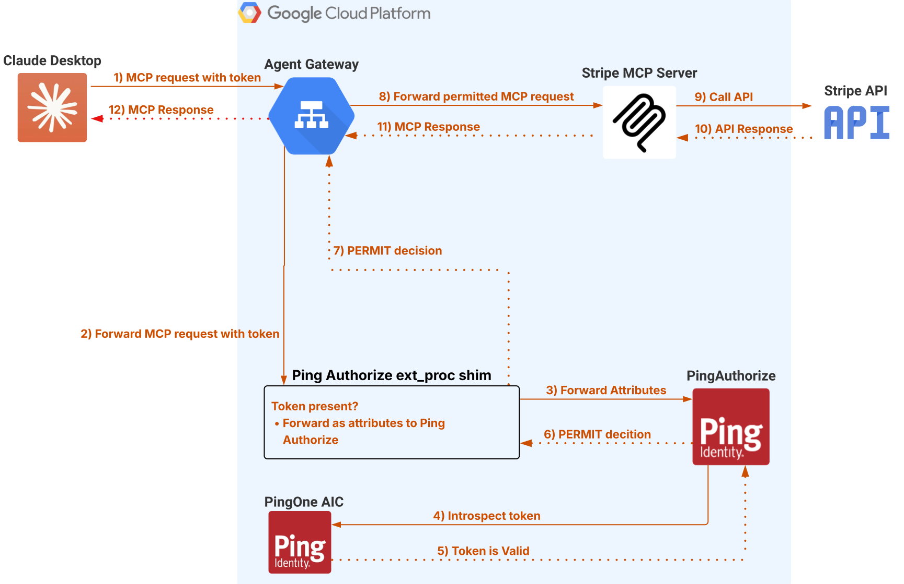

# Attended Agent

An attended agent connects **directly** to the MCP server through the Agent Gateway. The agent itself handles OAuth discovery, client registration, and token acquisition with no intermediate backend. This model is typical of MCP-aware clients such as Claude Desktop or Cursor.

```
Agent → Agent Gateway → ping-authz-shim → PingAuthorize → stripe-mcp
```

## How It Works

### 1. Obtaining an Access Token


1. The agent sends a request to the Agent Gateway without an access token
2. The Agent Gateway invokes `ping-authz-shim` via a Traffic Extension callout
3. The shim rejects the request with `401 Unauthorized` and a `WWW-Authenticate` header containing the protected resource metadata URL and required scopes
4. The agent discovers the authorization server by fetching `/.well-known/oauth-protected-resource` ([RFC 9728](https://datatracker.ietf.org/doc/html/rfc9728)), which the shim passes through to the MCP server
5. The agent dynamically registers a client ([RFC 7591](https://datatracker.ietf.org/doc/html/rfc7591)) and completes an OAuth 2.0 authorization code flow with PKCE ([RFC 7636](https://datatracker.ietf.org/doc/html/rfc7636)) against [PingOne AIC](https://www.pingidentity.com/en/platform/pingone-advanced-identity-cloud.html) to obtain an access token

### 2. Authorizing a Request



1. The agent sends a request to the Agent Gateway with an access token
2. The Agent Gateway invokes `ping-authz-shim` via a Traffic Extension callout
3. The shim extracts the bearer token and parses the MCP JSON-RPC body to extract the method, tool name, and tool arguments
4. The shim sends the access token and extracted attributes to PingAuthorize for a policy decision
5. PingAuthorize evaluates the policy and returns allow or deny — rejected requests never reach the MCP server
6. Permitted requests are forwarded to `stripe-mcp`, which executes the requested tool on the user's behalf
7. The MCP server response is returned to the agent

## Services Involved

| Service | Role |
|---|---|
| [`ping-authz-shim`](../ping-authz-shim/) | Authorization shim — intercepts requests and consults PingAuthorize |
| [`stripe-mcp`](../stripe-mcp/) | MCP server — serves OAuth discovery metadata and executes Stripe tools |

## Key Concepts

### OAuth Discovery Chain

The attended agent relies on a chain of discovery documents to find and authenticate with the authorization server:

1. **Protected Resource Metadata** ([RFC 9728](https://datatracker.ietf.org/doc/html/rfc9728)) — served by `stripe-mcp` at `/.well-known/oauth-protected-resource`, points the agent to the authorization server and declares required scopes
2. **Authorization Server Metadata** ([RFC 8414](https://datatracker.ietf.org/doc/html/rfc8414)) — served by PingOne AIC, provides token endpoint, authorization endpoint, and supported grant types
3. **Dynamic Client Registration** ([RFC 7591](https://datatracker.ietf.org/doc/html/rfc7591)) — the agent registers itself as an OAuth client on first connection

### Passthrough Paths

The shim passes `/.well-known/*` requests through to the MCP server without authentication, allowing agents to complete OAuth discovery before they have a token.

### Policy Attributes

The same attributes are sent to PingAuthorize as in the [delegated agent](delegated-agent.md) flow. The difference is that the access token contains only the user's identity (no `act` claim), since the agent is acting as the user directly.
