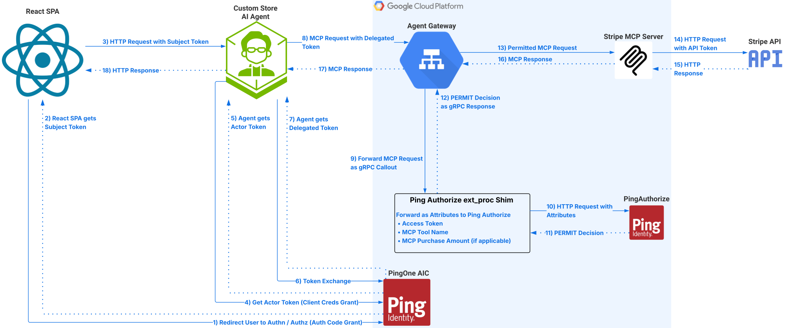

# Delegated Agent

A delegated agent is a backend service that acts **on behalf of a user** using [RFC 8693 Token Exchange with delegation](https://datatracker.ietf.org/doc/html/rfc8693#section-1.1). The user authenticates through a front-end application, and the agent exchanges the user's token for a delegated token that carries both the user's identity and the agent's identity. This enables PingAuthorize to make policy decisions based on **who the user is** and **which agent is acting for them**.

```
User → Chat UI → Agent Backend → Agent Gateway → ping-authz-shim → PingAuthorize → stripe-mcp
```

## How It Works



### 1. User Authentication

1. The user opens the chat UI and authenticates via an OAuth 2.0 authorization code flow with PKCE ([RFC 7636](https://datatracker.ietf.org/doc/html/rfc7636)) against [PingOne Advanced Identity Cloud](https://www.pingidentity.com/en/platform/pingone-advanced-identity-cloud.html)
2. The chat UI receives the user's access token (the **subject token**)

### 2. Token Exchange (Delegation)

1. The agent backend obtains its own access token via a client credentials grant (the **actor token**)
2. The agent performs an [RFC 8693](https://datatracker.ietf.org/doc/html/rfc8693) token exchange, presenting both the subject token and the actor token
3. PingOne AIC issues a **delegated access token** containing an `act` claim that identifies the agent, while the `sub` claim preserves the original user's identity
4. The agent uses this delegated token for all subsequent requests to the MCP server

### 3. Authorized Tool Execution

1. The agent sends an MCP request to the Agent Gateway with the delegated access token
2. The Agent Gateway invokes `ping-authz-shim` via a Traffic Extension callout
3. The shim parses the MCP JSON-RPC body to extract the method, tool name, and tool arguments (e.g., product ID, total price, currency)
4. The shim sends the access token and extracted attributes to PingAuthorize for a policy decision
5. PingAuthorize evaluates the policy — considering the user's identity, the agent's identity, and the specific tool and arguments — and returns allow or deny
6. Permitted requests are forwarded to `stripe-mcp`; denied requests are rejected before reaching the MCP server

## Services Involved

| Service | Role |
|---|---|
| [`ping-chat-ui-storefront`](../ping-chat-ui-storefront/) | Chat UI — authenticates the user and sends messages to the agent backend |
| [`ping-store-agent`](../ping-store-agent/) | Agent backend — manages sessions, performs token exchange, invokes MCP tools |
| [`ping-authz-shim`](../ping-authz-shim/) | Authorization shim — intercepts requests and consults PingAuthorize |
| [`stripe-mcp`](../stripe-mcp/) | MCP server — executes Stripe tools |

## Key Concepts

### The `act` Claim

The delegated access token includes an [`act` (actor) claim](https://datatracker.ietf.org/doc/html/rfc8693#section-4.1) that identifies the agent:

```json
{
  "sub": "user-uuid",
  "act": {
    "sub": "ping-store-agent"
  },
  "scope": ["stripe_mcp:invoke", "email"]
}
```

This allows PingAuthorize to distinguish between different agents acting on behalf of the same user and enforce agent-specific policies.

### The `may_act` Script

For delegation to work, the authorization server must include a `may_act` claim in the subject token that permits the agent to exchange it. This is configured via an OAuth2 May Act script in PingOne AIC:

```javascript
(function () {
    var mayAct = {
        client_id: "ping-store-agent",
        sub: "ping-store-agent"
    };
    token.setMayAct(mayAct);
}());
```

### Policy Attributes

When the shim intercepts a `tools/call` request, it extracts and sends the following attributes to PingAuthorize:

| Attribute | Description |
|---|---|
| `access_token` | The delegated JWT (contains `sub`, `act`, scopes) |
| `mcp_method` | MCP JSON-RPC method (e.g., `tools/call`, `tools/list`) |
| `mcp_tool_name` | Name of the tool being invoked (e.g., `create_stripe_payment_intent`) |
| `mcp_product_id` | Stripe product ID (payment intent only) |
| `mcp_purchase_quantity` | Purchase quantity (payment intent only) |
| `mcp_total_price` | Total price for the purchase (payment intent only) |
| `mcp_currency` | Currency code (payment intent only) |
