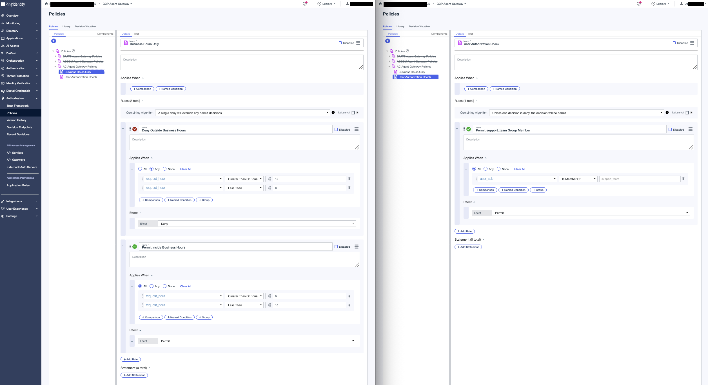
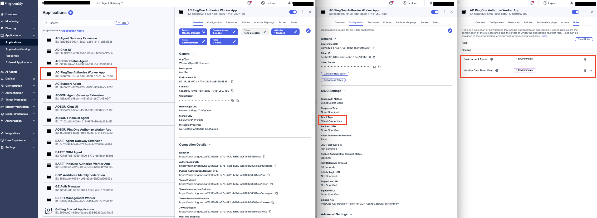
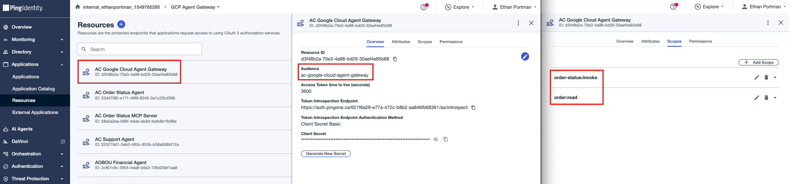

# Agent Gateway Extension Service

An Envoy `ext_proc` gRPC handler that the Agent Gateway calls on every request on the governed path. Deployed on Cloud Run, registered as a Service Extension. It governs both A2A and MCP hops:

```text
Support Agent → native A2A → Order Status Agent
Order Status Agent → MCP → Order Status MCP Server
```

For each matched target it:
1. Validates the caller's delegated token: `iss`, `aud`, and `scope`
2. On the hop's one known action (A2A `message:send`, MCP `tools/call`), calls PingOne Authorize with `user_sub` and `request_hour`; any error, DENY, or unknown body gets an immediate 403 — fail closed, no passthrough
3. On PERMIT, injects the token it reminted via an RFC 8693 exchange to the hop's final audience — `Authorization: Bearer` on the MCP hop; body metadata on the A2A hop, whose `Authorization` instead carries the Google credential that endpoint's IAM check requires

## Configure

### 1. PingOne Authorize - Trust Framework

In **Authorization → Trust Framework**, define the request attributes that PingOne Authorize will use to make a decision — exactly the two the extension sends, on both hops:
| Attribute | Type | Resolver Parameter |
|---|---|---|
| `user_sub` | String | `user_sub` |
| `request_hour` | Number | `request_hour` |


### 2. PingOne Authorize - Policies

In **Authorization → Policies**, create a Policy Set named `AC Agent Gateway Policies` with combining algorithm **DenyOverrides** (`Unless one decision is deny, the decision will be permit`). Add these 2 child policies:

**Policy 1: Business Hours Only** — combining: A single deny will override any permit decisions
- Rule `Deny Outside Business Hours`
- Rule `Permit Inside Business Hours`

**Policy 2: User Authorization Check** — combining: Unless one decision is deny, the decision will be permit
- Rule `Permit support_team Group Member`



### 3. PingOne Authorize - Publish and grab decision endpoint

Go to **Authorization → Version History** and publish the latest version.

Note the decision endpoint URL from **Authorization → Decision Endpoints**.

### 4. PingOne Authorize - Worker App

Create a **Worker** application in PingOne:
- **Name:** AC PingOne Authorize Worker App
- **Grant type:** Client Credentials
- **Roles:** Grant `Environment Admin` and `Identity Data Read Only` scoped to this environment



### 5. PingOne Token Exchange - OIDC Web App

Create an **OIDC Web App application** in PingOne:
- **Name:** AC Agent Gateway Extension
- **Grant Types:** enable both **Client Credentials** and **Token Exchange**
- Assign it both final resources so it may request `order-status:invoke` **from `AC Order Status Agent`** and `order:read` **from `AC Order Status MCP Server`**

### 6. PingOne resource (`ac-google-cloud-agent-gateway`)

**Create Resource Profile**

1. In the PingOne admin console, go to **Applications > Resources** and click the **+** icon.
2. For **Resource Name**, enter `AC Google Cloud Agent Gateway`.
3. For **Audience**, enter `ac-google-cloud-agent-gateway`.
4. For **Scopes**, enter `order-status:invoke` (used by Support Agent's exchange, hop 1) and `order:read` (used by Order Status Agent's exchange, hop 3).



**Attributes** — this is where the resource proves *who delegated to whom*. Token exchange works without it, but nothing would stop a caller from presenting an `actor_token` and having it accepted at face value; these attributes make PingOne itself attest to the actor, and refuse to mint a token if the actor isn't the one the subject token actually authorized.

1. **`sub`** — open the Advanced Expressions modal (gear icon), enter, and **leave `Required` unchecked**:
   ```text
   (#root.context.requestData.grantType == "client_credentials") ? "no-subject" : #root.context.requestData.subjectToken.sub
   ```
   The `subjectToken.sub` branch carries the user's identity through hops 1 and 3. The `client_credentials` branch is not optional — Support Agent's and Order Status Agent's own actor-token fetches are plain `client_credentials` calls against this resource with no `subjectToken`, and an unconditional expression 400s them all with `sub is configured as required...`, blocking the chain before any exchange runs. Leave `Required` unchecked even though the expression never returns null — the `Required` flag on the well-known `sub` claim is enforced on a separate code path that rejects real `client_credentials` requests even when the expression itself evaluates non-null (reproduced live: tester said non-null, call still 400'd; unchecking the flag alone fixed it).
2. **`act`** — Add attribute, Advanced Expressions, mark **required**:
   ```text
   (#root.context.requestData.grantType == "client_credentials")?"noActor":((#root.context.requestData.subjectToken.may_act.sub == #root.context.requestData.actorToken.client_id)?{"sub":#root.context.requestData.actorToken.client_id,"act":#root.context.requestData.subjectToken.act}:null)
   ```
   Wrapping the subject token's existing `act` inside the new actor (instead of overwriting it) is what makes the terminal token carry the whole delegation history, not just the previous actor — fully expanded chain in the root [README](../../README.md#token-chain).
3. **`may_act`** — Add attribute, Advanced Expressions:
   ```text
   {"sub":"<extension-client-id>"}
   ```
   The one expression here that can't be pasted verbatim: `<extension-client-id>` is the gateway extension's own PingOne client ID — the same value as `IDP_CLIENT_ID` in this service's `.env` (`fbd9fb33-...` in this deployment). It's a constant because hops 1 and 3 are the only exchanges onto this resource, and the only actor allowed next is this extension.
4. **`grant_type`** — Add attribute, Advanced Expressions, **leave `Required` unchecked**:
   ```text
   #root.context.requestData.grantType
   ```
   Adds the minting grant type (`urn:ietf:params:oauth:grant-type:token-exchange` on exchanged tokens) as a first-class claim.
5. Click **Next**.

### 7. Environment values

```bash
cp .env.sample .env
```

| Variable | Value |
|---|---|
| `GC_REGION` | Deploy region, e.g. `us-central1` |
| `GC_CLOUD_RUN_SERVICE_NAME` | `ac-agent-gateway-extension-service` |
| `IDP_TOKEN_ENDPOINT` | `https://auth.pingone.<region>/<env-id>/as/token` |
| `IDP_CLIENT_ID` | Token-exchange app Client ID |
| `IDP_CLIENT_SECRET` | Token-exchange app Client Secret |
| `AGENT_GATEWAY_AUDIENCE` | Shared intermediate audience the inbound delegated token must carry, e.g. `ac-google-cloud-agent-gateway` |
| `A2A_TARGET_URL` | Order Status Agent's A2A endpoint (`.../reasoningEngines/<engine-id>/a2a`) |
| `A2A_REQUIRED_AUDIENCE` | Final audience for the A2A hop, e.g. `order-status-agent` |
| `A2A_REQUIRED_SCOPE` | Final scope for the A2A hop, e.g. `order-status:invoke` |
| `MCP_TARGET_URL` | The Order Status MCP server's Cloud Run URL (with `/mcp` path) |
| `MCP_REQUIRED_AUDIENCE` | Final audience for the MCP hop, e.g. `order-status-mcp-server` |
| `MCP_REQUIRED_SCOPE` | Final scope for the MCP hop, e.g. `order:read` |
| `AUTHZ_DECISION_ENDPOINT` | PingOne Authorize decision endpoint URL |
| `AUTHZ_CLIENT_ID` | Authorize worker app Client ID |
| `AUTHZ_CLIENT_SECRET` | Authorize worker app Client Secret |


## Deploy

```bash
make deploy
```

`deploy` runs `setup`, then `push`, then `gcloud run deploy`.
