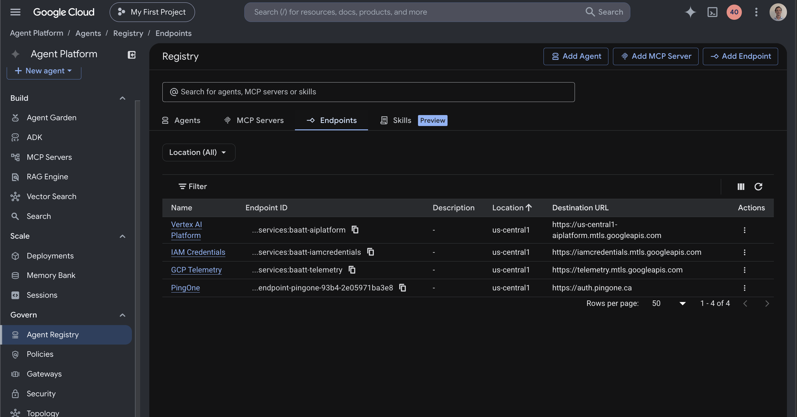

# Agent Gateway

The Agent Gateway is a **Google-managed** resource. You create it in the console and wire it with `gcloud`. It's the policy enforcement point: both agents' egress is routed through it, and it calls the [extension service](../agent-gateway-extension-service/README.md) via Envoy [External Processing (`ext_proc`)](https://www.envoyproxy.io/docs/envoy/latest/configuration/http/http_filters/ext_proc_filter) on every governed request.

Unlike the other journeys, this one has **two agents sharing one gateway** (Support Agent and Order Status Agent must stay deployed concurrently) and **two governed hops** — the A2A hop to Order Status Agent and the MCP hop to the Order Status MCP server.

### 1. Configure environment values

```bash
cp .env.sample .env
```

| Variable | Value |
|---|---|
| `GC_REGION` | Same region as the gateway and Cloud Run services |
| `GC_GATEWAY_NAME` | `ac-agent-gateway` |
| `GC_EXT_SVC_NAME` | Deployed extension service Cloud Run name |
| `GC_AUTHZ_EXTENSION` / `GC_AUTHZ_POLICY` | Names for the two resources this creates |

## 2. Create the gateway

In the console: **Agent Platform → Govern → Gateways → Add gateway**.

| Field | Value |
|---|---|
| **Name** | `ac-agent-gateway` |
| **Region** | Same as the two Cloud Run services |
| **Deployment mode** | Google-managed |
| **Governed Access Path** | Agent-to-Anywhere (egress) |
| **Access Authorization** | Enforce policies |

## 3. Attach the extension service

This wires the extension service to the gateway as a `CONTENT_AUTHZ` authorization extension — two resources: an **authorization extension** (points at your Cloud Run host) and an **authorization policy** (binds that extension to the gateway). Unlike aobou, the policy covers two path prefixes: the Reasoning Engine A2A path (`/v1beta1/projects/.../reasoningEngines/`) and `/mcp`.

```bash
make attach
```

`make attach` renders `authz-extension.tmpl.yaml` and `authz-policy.tmpl.yaml`
(filling in your project, region, and the ext-svc's live Cloud Run host), then
imports both with `gcloud`. Run `make render` alone to inspect the generated YAML
without importing. Config:

> **You'll now see two Service Extensions on the gateway — that's expected.**
> They're complementary, not duplicates:
>
> | Extension | Profile | Service | Role |
> |---|---|---|---|
> | `ac-agent-gateway-iap-authzextension` | `REQUEST_AUTHZ` | `iap.googleapis.com` | Google-managed, **auto-created** with the gateway. Enforces the IAP identity/egress check (`iap.egressor`) — this is the "Auth provider: Google Cloud Identity-Aware Proxy" shown on the gateway. |
> | `ac-agent-gateway-authz-extension` | `CONTENT_AUTHZ` | your Cloud Run ext-svc | The one you just created. Validates the delegated token, calls PingOne Authorize, and remints/injects the per-hop credential. |
>
> The IAP extension answers *"is this agent allowed to egress at all?"*; yours
> answers *"authorize, mint and inject the next-hop credential."* Both run on
> every governed request — leave the IAP one alone.


## 4. Register egress destinations

In **Agent Platform → Govern → Agent Registry**. The gateway governs **all**
agent egress, so every host the agents reach must be a registered destination.
Most are already handled:

- **Order Status MCP Server** — registered under **MCP Servers** when you deployed it. The registered URL must **match the URL the agent actually calls, host-for-host** — IAP resolves egress to a destination by host, and an unmatched host (e.g. the registry holds the stable `...-<PROJECT_NUMBER>.<REGION>.run.app` URL but the agent calls the direct revision `...-<hash>-<REGION>.a.run.app` one) is denied closed before your extension is ever invoked. The tell in the gateway log: `DENIED` with no `agentRegistryResource`. Re-registering with the exact URL also changes the registry resource ID — re-run the `iap.egressor` grant on it afterward.
- **Google APIs** (`aiplatform`, `iamcredentials`, `telemetry` on
  `*.mtls.googleapis.com`) — **auto-created** with the gateway for the runtime's
  own egress. Leave them alone.
- **PingOne** — under **Endpoints → Add endpoint**, Destination URL = your PingOne
  host (e.g. `https://auth.pingone.ca`).




## 5. Create the PingOne Resource for the gateway

In PingOne, create a **Resource** named `AC Google Cloud Agent Gateway` with the `ac-google-cloud-agent-gateway` audience and both `order-status:invoke` and `order:read` scopes — full attribute/`act`/`may_act` setup in the [extension service README](../agent-gateway-extension-service/README.md#7-pingone-resource-ac-google-cloud-agent-gateway).
