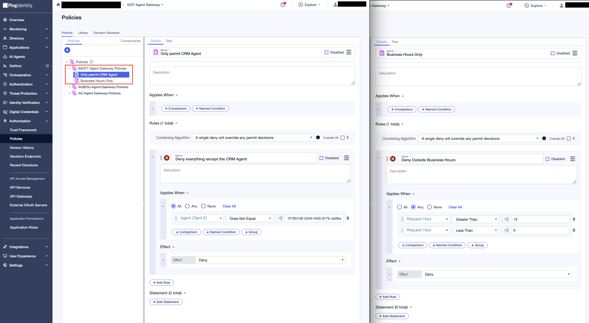
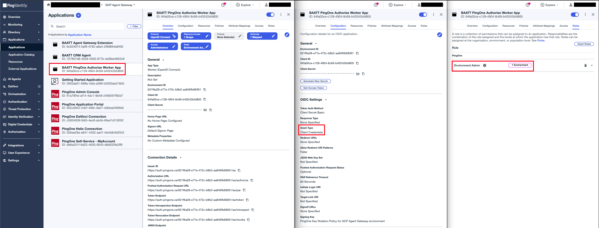
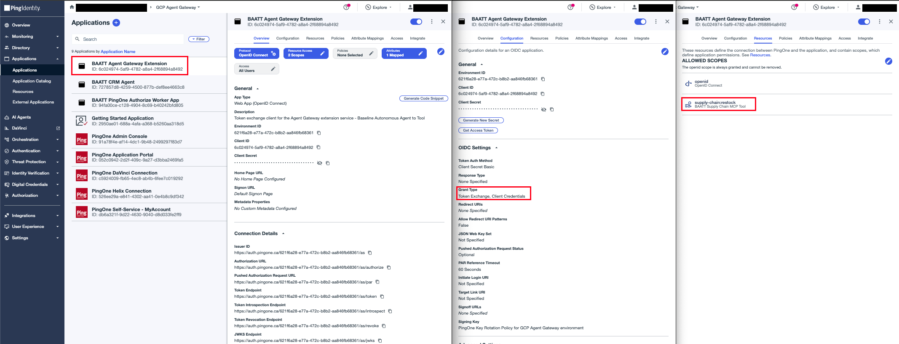

# Agent Gateway Extension Service

An Envoy `ext_proc` gRPC handler that the Agent Gateway calls on every request on the governed path. Deployed on Cloud Run, registered as a Service Extension.

For requests bound to the supply chain MCP tool it:
1. Validates the agent's delegated token: `iss`, `aud`, and `scope`
2. On `tools/call` requests, calls PingOne Authorize with the agent's identity and the request hour; non-`tools/call` requests (initialize, tools/list) skip Authorize
3. On PERMIT, performs an RFC 8693 exchange to produce a tool-audienced token, then injects it as `Authorization: Bearer` before forwarding the request to the supply chain MCP tool

## Configure

### 1. PingOne Authorize - Trust Framework

In **Authorization → Trust Framework**, define the request attributes that PingOne Authorize will use to make a decision.

| Attribute | Type | Resolver Parameter |
|---|---|---|
| `agent_client_id` | String | `agent_client_id` |
| `request_hour` | Number | `request_hour` |

### 2. PingOne Authorize - Policies

In **Authorization → Policies**, create a Policy Set named `BAATT Agent Gateway Policies` with combining algorithm **DenyOverrides** (`Unless one decision is deny, the decision will be permit`). Under DenyOverrides, unmatched requests default to permit — so the set is deny rules only:

- `Deny other agents` — when `agent_client_id` is not the CRM agent's client ID
- `Deny outside business hours` — when `request_hour` is not between 8 and 17 (Pacific)



### 3. PingOne Authorize - Publish and grab decision endpoint

Go to **Authorization → Version History** and publish the latest version.

Note the decision endpoint URL from **Authorization → Decision Endpoints**.

### 4. PingOne Authorize - Worker App

Create a **Worker** application in PingOne:
- **Name:** BAATT PingOne Authorize Worker App
- **Grant type:** Client Credentials
- **Roles:** Grant `Environment Admin` scoped to this environment



### 5. PingOne Token Exchange - OIDC Web App App

Create an **OIDC Web App application** in PingOne
- **Name:** BAATT Agent Gateway Extension
- **Grant Types:** enable both **Client Credentials** and **Token Exchange**
- Assign it the `supply-chain-mcp-tool` resource so it may request the `supply-chain:restock` scope



## Configure environment values

```bash
cp .env.sample .env
```

| Variable | Value |
|---|---|
| `GC_REGION` | Deploy region, e.g. `us-central1` |
| `GC_CLOUD_RUN_SERVICE_NAME` | `baatt-agent-gateway-extension-service` |
| `IDP_TOKEN_ENDPOINT` | `https://auth.pingone.<region>/<env-id>/as/token` |
| `IDP_CLIENT_ID` | Token-exchange worker app Client ID |
| `IDP_CLIENT_SECRET` | Token-exchange worker app Client Secret |
| `IDP_SCOPE` | Scope the inbound token must carry, e.g. `supply-chain:restock` |
| `IDP_REQUIRED_AUDIENCE` | Expected `aud` on the inbound token, e.g. `supply-chain-mcp-tool` |
| `TOOL_URL` | The MCP tool's Cloud Run base URL |
| `AUTHZ_DECISION_ENDPOINT` | PingOne Authorize decision endpoint URL |
| `AUTHZ_CLIENT_ID` | Authorize worker app Client ID |
| `AUTHZ_CLIENT_SECRET` | Authorize worker app Client Secret |

## Deploy

```bash
make deploy
```

`deploy` runs `setup`, then `push`, then `gcloud run deploy`.
